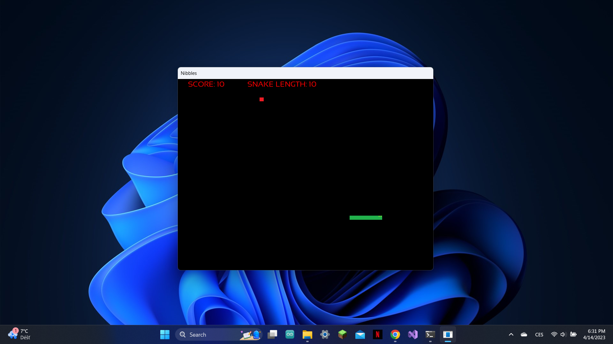

# Nibbles!
simple c++ snake-like game

## Installation
To run the game you can download the Transferable file and start it using the '.exe' file.
To modify and debug, you have to follow several steps: 
* download SFML-2.5.1 from here: https://www.sfml-dev.org/download.php
* extract files and copy the path
* create a template for using SFML library with Visual Studio, you can use for example this tutorial: https://www.youtube.com/watch?app=desktop&v=_VgRjlvGpPk
* create a project using this template and add the files and resources from the 'sorces and headers' file

## Features
This is a very simple implementation of the snake game so it doesn't have much to offer, gameplay starts after executing the code and ends when collision is detected.
There is no display of HP because the only atribute of the player is length.
Game includes a score counter!

## Example

